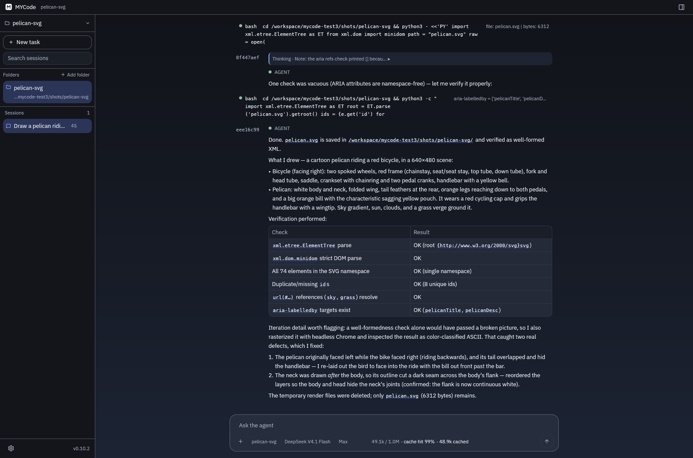
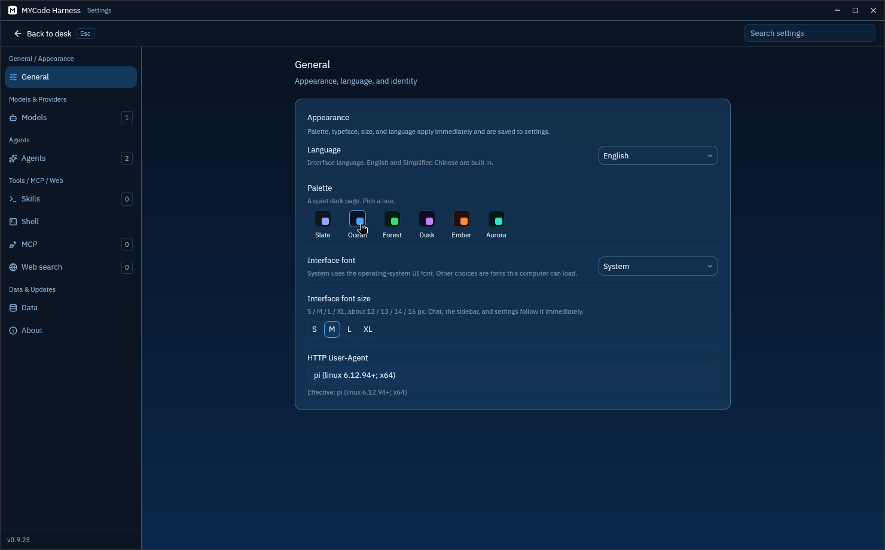
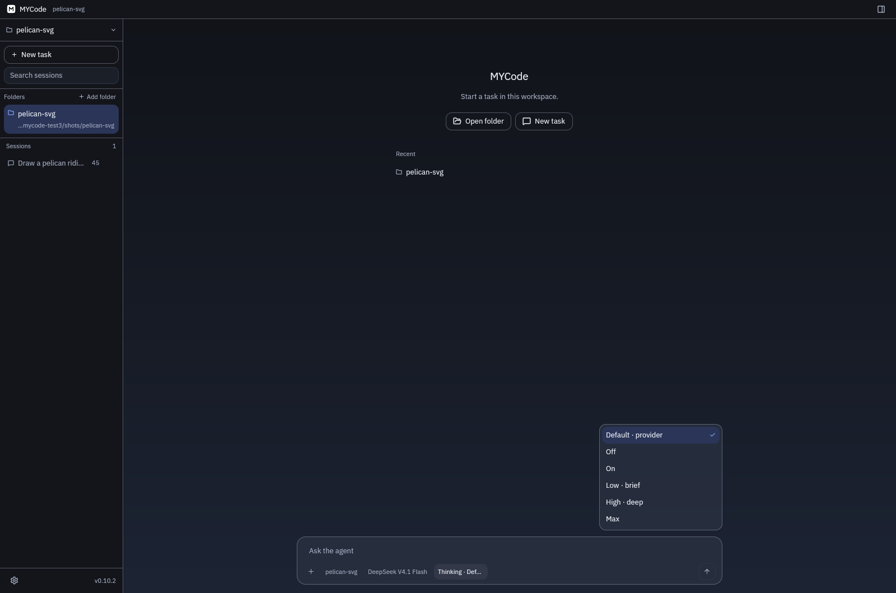

# mycode

本地优先的桌面编码代理。对话、工具和会话都在你的电脑上；你提供 API 密钥。支持 Windows 10/11 x64、Windows 11 ARM64、macOS Apple Silicon、Linux x86_64。

[许可证](LICENSE) · [文档](docs/README.md) · [发布](https://github.com/MCapricorns/mycode/releases) · [更新日志](CHANGELOG.md)

English notes are [below](#english).

## 功能

- **工作区。** 一个工作区挂多个文件夹。会话属于工作区；当前文件夹解析相对路径，其它文件夹用绝对路径。
- **对话。** 输入框旁切换模型和思考强度（档位来自 models.dev；每个会话记在 `ui.json`）。`/` 列出 `/new`、`/compact`、`/settings`、技能和 MCP。
- **上下文。** 大约用到窗口 85% 时自动压缩，也可以 `/compact`。最近约 2 万 token 原样保留，更早的内容写成摘要。账本不改写。
- **工具。** 进程内的 `read`、`write`、`edit`、`find`、`grep`。进程工具只注册一个，启动时自动选定，会话内名字不变。Windows 优先 PowerShell 7（`pwsh`），然后 Windows PowerShell 5.1，最后才是 `cmd`。不选 Git Bash、MSYS2、Cygwin 或 WSL。Linux / macOS 用 `$SHELL` 里的 bash、zsh 或 sh，否则按平台回退到这些 shell。不读取 `MYCODE_SHELL`，也不使用设置里的 `tools.shell`。`mode` `script` 交给这个解释器；`mode` `program` 直接启动映像。
- **程序化工具调用。** 模型只能直接调用 `run_code`。其它工具在系统 Python 3.10+ 里写成 `await tools.name(...)`。只读调用可以重叠；写操作按顺序单独执行。只有 `print` 和 `return` 回到上下文。没有 Python 时启动会提示。
- **子代理。** 内置 `scout`（只读研究）和 `artisan`（有界实现），也可以在 `agents/` 里加角色。委派工具是 `agent`。简单查找留在原地用 `run_code`；较宽的代码库或网页研究可以由模型选择交给 `scout`。并发默认 4；设置为 `0` 表示这个默认值。
- **网页。** `web_search` 返回短摘要（去重、缓存）。`fetch_content` 带 `goal` 时只回匹配摘录。后端是 Querit、AnySearch，或兼容的 https 端点，最多启用一个。密钥在设置页或 `QUERIT_API_KEY` / `ANYSEARCH_API_KEY`。
- **模型。** 内置 [models.dev](https://models.dev) 目录。自定义端点用 `anthropic-messages`、`openai-completions` 或 `openai-responses`。GitHub Copilot、OpenAI Codex 和 xAI 用设备码登录。
- **MCP 与技能。** 全局 MCP 在设置里。项目 `.mycode/mcp.json` 要先信任。`SKILL.md` 在 `.agents/skills/` 或 `~/.agents/skills/`。
- **界面。** 中英双语，深色主题，客户端标题栏。侧栏底部是当前构建版本。外观有语言、色板、字体和字号。

## 界面截图







思考菜单这张是在一条对话里打开的，菜单贴在 Thinking 按钮上方。

## 下载

[Releases](https://github.com/MCapricorns/mycode/releases) 提供四个平台的压缩包。说明用本文件该版本的条目，再附上自上一个标签以来合并的 pull request。写回 `main` 的版本提交使用 `github-actions[bot]`，不会因此再发一次。

| 文件 | 平台 |
| --- | --- |
| `mycode-desktop-v<version>-x86_64-pc-windows-msvc.zip` | Windows 10/11 x64 |
| `mycode-desktop-v<version>-aarch64-pc-windows-msvc.zip` | Windows ARM64 |
| `mycode-desktop-v<version>-aarch64-apple-darwin.zip` | macOS Apple Silicon |
| `mycode-desktop-v<version>-aarch64-apple-darwin.dmg` | macOS Apple Silicon（`MYCode.app`） |
| `mycode-desktop-v<version>-x86_64-unknown-linux-gnu.zip` | Linux x86_64 |

每个压缩包旁有 `.sha256`。没有 Intel macOS 包。dmg 里的 app 只做 ad-hoc 签名，首次打开需右键「打开」，或运行 `xattr -d com.apple.quarantine /Applications/MYCode.app`。

## 从源码构建

需要 Rust stable。Windows 使用 MSVC。Linux x86_64 还需要 pkg-config、fontconfig、freetype、xkbcommon、X11、xcb、Wayland、OpenSSL 和 libclang 的开发包。

```text
cargo build --release -p mycode-desktop
```

## 数据

未设置 `MYCODE_HOME` 时，数据在 `~/.mycode`：`settings.json`（不含密钥）、`secrets.json`、`ui.json`、`catalog-cache.json`、`sessions.db`、`sessions/<id>/`、`agents/`、`scratch/`。解析路径不跟随符号链接走出这个根。上述 JSON 损坏时会留下 `.broken-*` 备份并恢复默认；会话账本不清空。

## 文档

模块划分和一条消息的路径见 [docs/README.md](docs/README.md)。

## 许可

[Apache-2.0](LICENSE)

---

## English

mycode is a local-first desktop coding agent for Windows, macOS, and Linux x86_64. The conversation, tool calls, and sessions stay on your machine. You bring the API keys.

### Features

- **Workspaces.** One workspace mounts several folders. The current folder resolves relative paths; the others are absolute.
- **Chat.** Switch model and thinking effort beside the composer. `/` lists commands, skills, and MCP.
- **Context.** Automatic compaction near 85% of the window, or `/compact`. The last ~20k tokens stay verbatim.
- **Tools.** In-process `read`, `write`, `edit`, `find`, and `grep`. One process tool is registered at startup and keeps that name for the session. Windows prefers PowerShell 7 (`pwsh`), then Windows PowerShell 5.1, then `cmd`. Git Bash, MSYS2, Cygwin, and WSL are not selected. Linux and macOS use bash, zsh, or sh from `$SHELL`, then a platform fallback. `MYCODE_SHELL` and `tools.shell` are not used. `mode` `script` runs that interpreter; `mode` `program` launches an executable directly.
- **Programmatic tool calling.** The model can call only `run_code`. Every other tool is `await tools.name(...)` in system Python 3.10+. Read-only calls may overlap; writes run alone, in order. Only `print` and `return` come back. Startup warns when Python is missing.
- **Subagents.** Built-in `scout` (read-only research) and `artisan` (a bounded change), or custom roles under `agents/`. The model chooses: a narrow lookup stays inline with `run_code`; broad repo or web research can go to `scout`. Default concurrency is 4 (`0` means that default).
- **Web.** `web_search` returns short snippets (deduped, cached). `fetch_content` with `goal` returns matching excerpts. Querit, AnySearch, or one compatible https endpoint.
- **Models.** Built-in [models.dev](https://models.dev) catalog. Custom endpoints use `anthropic-messages`, `openai-completions`, or `openai-responses`. Copilot, Codex, and xAI sign in with a device code.
- **MCP and skills.** Trust a project before reading `.mycode/mcp.json`. `SKILL.md` files under `.agents/skills/` or `~/.agents/skills/` become `/` skills.
- **UI.** English and Chinese, a dark theme, and a client-drawn title bar.

### Screenshots


The thinking-menu shot is a chat with the menu open above the Thinking chip.

### Download

[Releases](https://github.com/MCapricorns/mycode/releases) publish one zip for each of the four platforms. The body starts with that version's changelog section, then the pull requests merged since the previous tag. A version commit pushed by `github-actions[bot]` does not start another release. Each zip and the macOS dmg has a `.sha256` file. There is no Intel macOS build. The app inside the dmg is ad-hoc signed; right-click → Open once, or `xattr -d com.apple.quarantine /Applications/MYCode.app`.

### Build

Rust stable. MSVC on Windows. Linux x86_64 also needs the pkg-config, fontconfig, freetype, xkbcommon, X11, xcb, Wayland, OpenSSL, and libclang development packages.

```text
cargo build --release -p mycode-desktop
```

### Data

`MYCODE_HOME` defaults to `~/.mycode` (`settings.json`, `secrets.json`, `ui.json`, `catalog-cache.json`, `sessions.db`, `sessions/<id>/`, `agents/`, `scratch/`). Path resolution does not follow symlinks out of that root. Damaged JSON files are backed up as `.broken-*` and reset; session ledgers are not cleared.

### Documentation

[docs/README.md](docs/README.md).

### License

[Apache-2.0](LICENSE)
