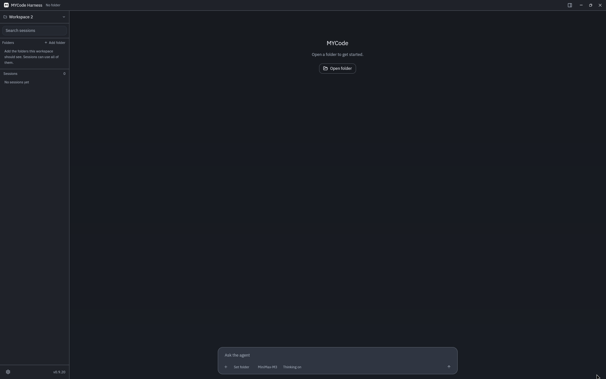
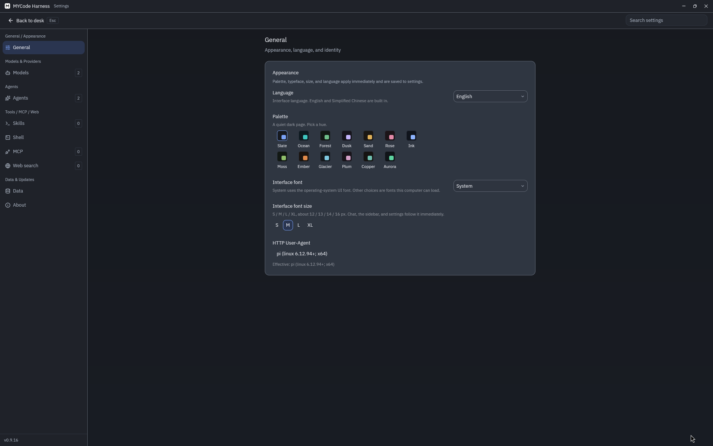

# mycode

本地优先的桌面编码代理。对话、工具调用和会话都在你自己的电脑上；你填 API 密钥，应用负责回合、工具和界面。发布包支持 Windows 10/11 x64、Windows 11 ARM64、macOS Apple Silicon 与 Linux x86_64。

[许可证](LICENSE) · [文档](docs/README.md) · [发布](https://github.com/MCapricorns/mycode/releases) · [更新日志](CHANGELOG.md) · [X（@M_Capricorns）](https://x.com/M_Capricorns)

English notes are [below](#english).

## 功能

- **命名工作区。** 一个工作区挂多个文件夹（例如前端和后端）。会话属于工作区；当前文件夹解析相对路径，其它文件夹用绝对路径。
- **对话。** 输入框旁切换模型和思考强度。
- **改动。** 右侧是当前模型和该文件夹的 git 改动，点文件看 diff。
- **模型。** 内置 [models.dev](https://models.dev) 目录，粘贴密钥即可用。自定义端点使用 `anthropic-messages`、`openai-completions` 或 `openai-responses`。支持 Copilot、Codex、xAI 的设备码登录。
- **工具。** 进程内的 `read` / `write` / `edit` / `find` / `grep`，以及 `shell`（`script` 走平台 shell，可以用 Python heredoc 或短脚本改文件；`program` 直接启动钉住的程序映像）。这些改动都没有文件撤销。网页检索、向你提问、`agent` 和 MCP 走同一张注册表。
- **子代理。** 内置 scout、artisan，也可以在 `agents/` 里加 Markdown 角色。委派工具是 `agent`。并发默认 4 个；设置里的 `0` 表示这个默认值，不是零个子代理。子代理没有墙钟超时。
- **界面。** 中英双语，深色界面。全平台使用客户端绘制的标题栏（CSD）：系统标题栏隐藏，最小化、最大化和关闭在右侧。状态栏版本为 **v0.9.18**。没有打开工作区时，空工作台只有「打开目录」；打开文件夹之后才出现「新建任务」。设置里的外观包括语言、色板（石板灰、海洋、森林、暮色、沙丘、玫瑰、墨色、苔原、余烬、冰川、梅紫、铜绿、极光）、界面字体，以及界面字号 S / M / L / XL。对话里的代码块用 gpui-kit 的 Tree-sitter 高亮。发现新版本后下载校验，确认后再重启安装。读不了的 `settings.json`、`ui.json`、`secrets.json` 和模型目录缓存会先备份再恢复默认，会话账本不动。

工具行会写明目标：读了哪个文件、搜了什么、跑了哪条命令。密钥只在 `secrets.json`，设置页对已保存的钥匙显示一把锁。

## 界面

v0.9.18。标题栏由客户端绘制。没有打开工作区时，空工作台只有「打开目录」。



外观页：语言、色板、界面字体、界面字号 S–XL。



## 下载

发布页：[Releases](https://github.com/MCapricorns/mycode/releases)

| 文件 | 平台 |
| --- | --- |
| `mycode-desktop-v<version>-x86_64-pc-windows-msvc.zip` | Windows 10/11 x64 |
| `mycode-desktop-v<version>-aarch64-pc-windows-msvc.zip` | Windows 11 ARM64 |
| `mycode-desktop-v<version>-aarch64-apple-darwin.zip` | macOS Apple Silicon |
| `mycode-desktop-v<version>-x86_64-unknown-linux-gnu.zip` | Linux x86_64 |

每个 zip 旁有 `.sha256`。0.4.0 之后不再提供 Intel macOS 构建。

## 从源码构建

需要 Rust stable。Windows x64 与 Windows ARM64 都使用 MSVC。Linux x86_64 还需要 pkg-config、fontconfig、freetype、xkbcommon、X11、xcb、Wayland、OpenSSL 和 libclang 的开发包。

```text
cargo build --release -p mycode-desktop
```

发布配置打开 fat LTO，链接会比开发构建慢。开发配置只保留行号表，避免调试信息占满磁盘。

## 数据

`MYCODE_HOME` 未设置时，数据在 `~/.mycode`。

```text
~/.mycode/
├─ settings.json          提供商、MCP、网页、外观。不含密钥
├─ secrets.json           API 密钥
├─ ui.json                工作区、文件夹、会话归属
├─ catalog-cache.json     模型目录缓存
├─ sessions.db            会话索引（SQLite：标题、分支头、JSONL 偏移）
├─ sessions/<id>/         `<branch>.jsonl`、载荷与压缩检查点
└─ scratch/               未绑定文件夹时的工作目录
```

更早版本留下的 `checkpoints/<id>/` 会在删除会话时清掉。新的回合不再写文件快照。

把整个目录换到另一台机器时，设置 `MYCODE_HOME` 指向它。应用不会跟随符号链接走出这个根。上述四个 JSON 损坏时会在同目录留下 `.broken-*` 备份并恢复默认；`sessions.db` 和 `sessions/` 不会因此被清空。

## 文档

模块怎么划分、一条消息怎么走完，见 [docs/README.md](docs/README.md)。

## 开发

本地可以这样检查格式和 clippy。持续集成不跑这道检查。

```text
cargo fmt --all -- --check
cargo clippy --workspace --all-targets --locked -- -D warnings
cargo test -p mycode-tools --lib native_image_launches --locked
```

pull request 和推送到 `main` 都会在 Windows x64、Windows ARM64、macOS Apple Silicon 和 Linux x86_64 上构建并打包四个平台的 release 二进制（zip 与 `.sha256`）。pull request 不创建标签、不发 GitHub Release、不改版本、不推 `ci/release-*`。推送到 `main` 并完成四个平台构建后，每次都会新建 GitHub Release：新标签 `v<version>`、四个平台的 zip（Windows x64、Windows ARM64、macOS Apple Silicon、Linux x86_64）和对应 `.sha256`，发布说明取 `CHANGELOG.md` 里该版本的条目，不从提交记录生成。`Cargo.toml` 里的版本如果已经有标签，发布计划会把补丁号加一，写回 `Cargo.toml`、`Cargo.lock` 和 `CHANGELOG.md`，并把这次提交推到临时引用 `ci/release-<version>-<run id>`。Windows x64、Windows ARM64、macOS Apple Silicon 和 Linux x86_64 都从这次提交构建。四个构建都成功之后，先用该提交创建标签并上传压缩包，再把版本写回 `main`：能快进就快进；若构建期间 `main` 有了新提交，就把版本提交重放到当前 `main` 上再推送（不强制推送；只自动处理 `Cargo.toml`、`Cargo.lock`、`CHANGELOG.md` 的冲突，计划中的版本号保留，构建期间写进 `## [Unreleased]` 的新说明也保留）。临时引用会在成功或失败后删除。因此二进制里的版本与标签一致。写在 `CHANGELOG.md` 的 `## [Unreleased]` 下的内容会移到这个新版本下；该节为空时用一句固定说明。旧版本的压缩包已经齐，也不会跳过这次发布。手动把 `Cargo.toml` 改到一个还没有标签的版本时，`CHANGELOG.md` 里必须已经有该版本的条目。这些压缩包没有签名，仓库里没有可用的代码签名证书。

## 许可

[Apache-2.0](LICENSE)

---

## English

mycode is a local-first desktop coding agent for Windows, macOS, and Linux x86_64.
The conversation, the tool calls, and every session stay on your machine.
You bring the API keys. Follow [@M_Capricorns](https://x.com/M_Capricorns) on X.

### Features

- **Named workspaces.** One workspace mounts several folders. Sessions
  belong to the workspace. The current folder resolves relative paths;
  the others are absolute.
- **Chat.** Switch model and thinking effort beside the composer.
- **Changes.** The right-hand pane shows the session model and the
  current folder's git diff.
- **Models.** The built-in [models.dev](https://models.dev) catalog
  covers common providers. Custom endpoints speak
  `anthropic-messages`, `openai-completions`, or `openai-responses`.
  Copilot, Codex, and xAI can sign in with a device code.
- **Tools.** In-process `read`, `write`, `edit`, `find`, and `grep`.
  `shell` is the only process tool: `mode` `program` launches a pinned
  executable with no shell, and `mode` `script` uses your shell profile,
  including a Python heredoc or short script that edits files. Those edits
  are not undone.
  Web search, questions, the `agent` tool, and MCP share one registry.
- **Subagents.** Built-in scout and artisan roles,
  or custom Markdown roles under `agents/`. The delegation tool is
  `agent`. Concurrent sub-agents default to 4; a setting of `0` uses
  that default and does not mean zero agents. A sub-agent has no
  wall-clock timeout.
- **UI.** English and Chinese, a dark theme, and a client-drawn title
  bar (CSD) on every platform: the system title bar stays hidden, and
  minimize, zoom, and close sit on the right.   The status badge reads
  **v0.9.18**. With no workspace open, the empty desk offers Open folder
  only; New task appears after a folder is open. Appearance has
  Language, then the palettes slate, ocean, forest, dusk, sand, rose,
  ink, moss, ember, glacier, plum, copper, and aurora, plus Interface
  font and sizes S–XL. Fenced code in the transcript is highlighted
  with gpui-kit's Tree-sitter grammars. Updates download and verify,
  then wait for a restart confirmation. Unreadable `settings.json`,
  `ui.json`, `secrets.json`, and the model catalog cache are backed up
  and reset to defaults. Session ledgers are left alone.

A tool line names its target: which file was read, what was searched,
which command ran. Keys live only in `secrets.json`. Saved keys show as
a lock in Settings.

### Screenshots

v0.9.18. The title bar is client-side (CSD). With no workspace open, the empty desk offers Open folder.


Appearance: Language, palette, Interface font, and S–XL.


### Download

[Releases](https://github.com/MCapricorns/mycode/releases)

| Asset | Platform |
| --- | --- |
| `mycode-desktop-v<version>-x86_64-pc-windows-msvc.zip` | Windows 10/11 x64 |
| `mycode-desktop-v<version>-aarch64-pc-windows-msvc.zip` | Windows 11 ARM64 |
| `mycode-desktop-v<version>-aarch64-apple-darwin.zip` | macOS Apple Silicon |
| `mycode-desktop-v<version>-x86_64-unknown-linux-gnu.zip` | Linux x86_64 |

Each zip has a `.sha256` sidecar. Intel macOS builds stopped after 0.4.0.

### Build

Rust stable. MSVC on Windows x64 and Windows ARM64. Linux x86_64 also needs the pkg-config,
fontconfig, freetype, xkbcommon, X11, xcb, Wayland, OpenSSL, and libclang
development packages.

```text
cargo build --release -p mycode-desktop
```

Release builds use fat LTO. Dev builds keep line tables only, so
debuginfo stays small.

### Data

`MYCODE_HOME` defaults to `~/.mycode`.

```text
~/.mycode/
├─ settings.json
├─ secrets.json
├─ ui.json
├─ catalog-cache.json
├─ sessions.db
├─ sessions/<id>/
└─ scratch/
```

`sessions.db` is the SQLite index. `sessions/<id>/` holds `<branch>.jsonl`,
payloads, and compaction checkpoints. Older installs may still have
`checkpoints/<id>/`. Deleting a session removes that directory. New turns
do not write file snapshots.

Point `MYCODE_HOME` at a copied tree to move the app. Path resolution
does not follow symlinks out of that root. A damaged copy of the four
JSON files above is kept as a `.broken-*` backup and replaced with
defaults. `sessions.db` and `sessions/` are not cleared for that.

### Documentation

Module boundaries and the path of one user message:
[docs/README.md](docs/README.md).

### Development

Format and clippy can be checked locally. Continuous integration does not run that check.

```text
cargo fmt --all -- --check
cargo clippy --workspace --all-targets --locked -- -D warnings
cargo test -p mycode-tools --lib native_image_launches --locked
```

Pull requests and pushes to `main` build and package the four platform
release binaries on Windows x64, Windows ARM64, macOS Apple Silicon, and
Linux x86_64 (zip and `.sha256`). Pull requests do not publish, tag, bump the version, or push
a `ci/release-*` ref. A push to
`main` publishes a new GitHub Release after those four builds succeed: a new
`v<version>` tag, the four platform zips (Windows x64, Windows ARM64,
macOS Apple Silicon, and Linux x86_64), their `.sha256` sidecars, and the matching
`CHANGELOG.md` section (not generated commit notes). When
that version already has a tag, release-plan bumps the patch in
`Cargo.toml`, `Cargo.lock`, and `CHANGELOG.md` and pushes that commit
only to `ci/release-<version>-<run id>`. Windows x64, Windows ARM64,
macOS Apple Silicon, and Linux x86_64 are built from that commit. After those four builds
succeed, the tag and archives are published from that commit, then `main`
is updated: fast-forward when it still can, otherwise the version bump is
replayed onto current `main` and pushed without force. A replay resolves
conflicts only in `Cargo.toml`, `Cargo.lock`, and `CHANGELOG.md`, keeping
the planned version and any `## [Unreleased]` notes that landed on `main`
during the build. The temporary ref is deleted after success or failure.
The version compiled into the binaries matches the tag. Notes under
`## [Unreleased]` in `CHANGELOG.md` move into that version; an empty
section gets one fixed sentence. Archives already uploaded for an older
tag do not skip the release. A hand-bumped version that has no tag yet
still needs its own `CHANGELOG.md` section. The zip archives are
unsigned; this repository has no code-signing certificate.

### License

[Apache-2.0](LICENSE)
